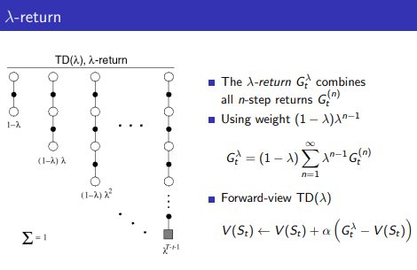
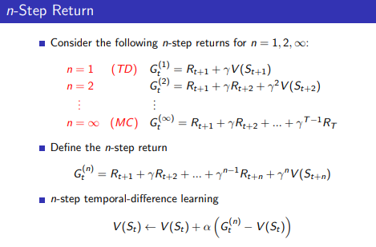
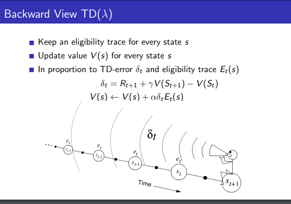
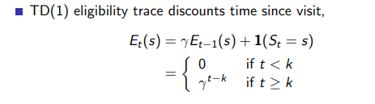

### Implementation Note
***
#### TD Lambda forward-view
The implmentation uses forward-view and discount factor of one. Learning rate and lambda are set to 0.1 and 0.9 respectively.

The value function update is defined as follow:

Note that G_t is defined as follow :

***
#### TD Lambda backward-view (eligibility trace)
The implmentation uses backward-view and discount factor of one. Learning rate and lambda are set to 0.1 and 0.9 respectively.

The value function update is defined as follow:

Where a lambda dicounte is applied to the eligibility trace:
